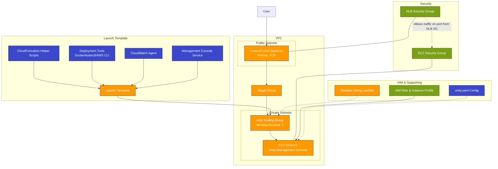

# Cloudformation Template Diagram

The diagram below shows the architecture of the cloudformation template.

```mermaid
graph TB
    User[User] --> NLB

    subgraph "VPC"
        subgraph "Public Subnets"
            NLB[Network Load Balancer\ninternal, TCP]:::aws
        end
        
        subgraph "Private Subnets"
            ASG[Auto Scaling Group\nMin/Max/Desired: 1]:::aws
            EC2[EC2 Instance\nUnity Management Console]:::aws
        end
        
        NLB --> TG[Target Group]:::aws
        TG --> ASG
        ASG --> EC2
    end
    
    subgraph "Security"
        NLBSG[NLB Security Group]:::security --- NLB
        MCSG[EC2 Security Group]:::security --- EC2
        NLBSG -.->|"Allows traffic on port from NLB SG"| MCSG
    end
    
    subgraph "Launch Template"
        LT[Launch Template]:::aws --> ASG
        CFN[CloudFormation Helper Scripts]:::config --> LT
        TOOLS[Deployment Tools\nDocker/kubectl/AWS CLI]:::config --> LT
        CW[CloudWatch Agent]:::config --> LT
        MC[Management Console Service]:::config --> LT
    end
    
    subgraph "IAM & Supporting"
        IAM[IAM Role & Instance Profile]:::security --> EC2
        LAMBDA[Random String Lambda]:::aws -.-> ASG
        CONFIG[unity.yaml Config]:::config -.-> EC2
    end
        
    classDef aws fill:#FF9900,stroke:#232F3E,color:white;
    classDef security fill:#7AA116,stroke:#232F3E,color:white;
    classDef config fill:#3B48CC,stroke:#232F3E,color:white;

```